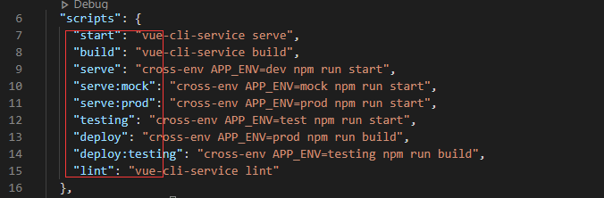
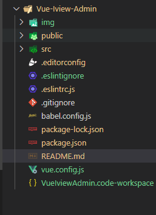
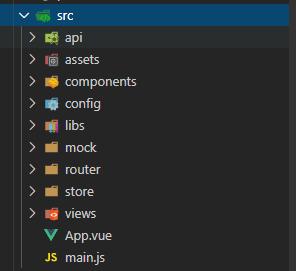

# ics-admin

## 项目安装依赖

``
npm install
``

### 运行项目

``
npm run serve:mock
``

> 其他命令直接查看package.json 即可

## 编译生成生产环境项目

``
npm run deploy
``

## 根目录下说明

| # | 描述 |
| --- | --- |
| public | 静态资源 |
| src | 项目源码目录  |
| .editorconfig | 用于定义编码样式的文件格式和一组文本编辑器插件组成 |
| .eslintignore | 主要作用是忽略哪些文件的语法检查 |
| .eslintrc.js | ESlint配置文件 |
| babel.config.js | babel语法编译 |
| package.json | 项目基本信息 |
| vue.config.js | vue配置文件 |

## src 目录下说明

| # | 描述 |
| --- | --- |
| api | 模块页面所有的 API 请求接口 |
| assets | 资源(css、images、fonts等)  |
| components | 用于定义项目中Vue公共组件 |
| config | 主要作用是忽略哪些文件的语法检查 |
| libs | 公共函数 |
| mock | babel语法编译 |
| router | vue的路由管理 |
| store |  vuex状态库 |
| views | 以页面为单位的vue文件、html文件等 |
| App.vue | 页面入口文件 |
| main.js | Vue程序入口文件，加载公共组件 |
